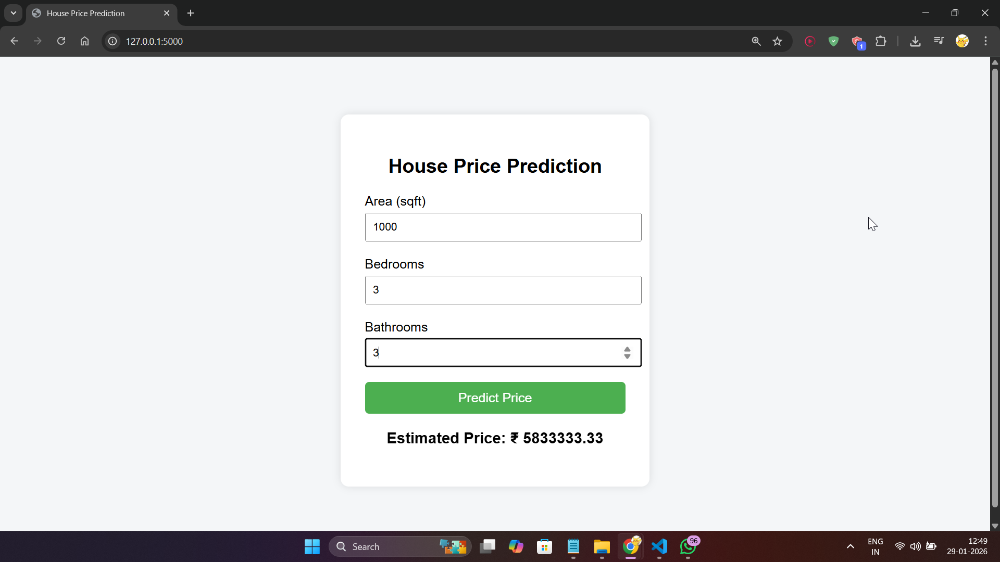

# END-TO-END-DATA-SCIENCE-PROJECT

COMPANY: CODTECH IT SOLUTIONS

NAME: Prem Dilip Dhumal

INTERN ID: CTIS1752

DOMAIN: Data Science

DURATION: 4 WEEKS

MENTOR: NEELA SANTOSH

##OUTPUT:

#description:

In this task, I developed a complete data science project starting from data collection and preprocessing to model deployment using Flask. The main objective of this task was to understand how a machine learning model is built and then deployed as a working web application so that users can interact with it in real time.

For this project, I used Visual Studio Code (VS Code) as my development environment. VS Code helped me manage all project files such as the dataset, Python scripts, HTML template, and trained model file. The integrated terminal was used to install required libraries and run the application.

The programming language used was Python, as it is widely used in data science and machine learning. Several Python libraries were used during this project. Pandas was used for data collection and handling CSV files. NumPy was used for numerical operations. Scikit-learn was used to train the machine learning model. Joblib was used to save and load the trained model. Flask was used to deploy the model as a web application.

The dataset used in this project was a simple house price dataset containing features such as area in square feet, number of bedrooms, number of bathrooms, and house price. This dataset represents a real-world regression problem where the output value depends on multiple input features.

The first step of the project was data collection and preprocessing. The dataset was loaded using Pandas, and input features were separated from the target variable. Basic preprocessing was performed to ensure the data was clean and ready for training. The input variables were selected carefully so that the model could learn meaningful relationships between house features and price.

After preprocessing, a machine learning model was created using Linear Regression from Scikit-learn. This algorithm was chosen because it is simple, efficient, and suitable for predicting continuous values such as house prices. The model was trained using the prepared dataset, and once training was completed, the model was saved as a .pkl file using Joblib. Saving the model allows it to be reused later without retraining.

The next step was model deployment. A Flask web application was developed to load the trained model and provide prediction functionality. Flask routes were created to handle user input and generate predictions. When the user enters values such as area, bedrooms, and bathrooms in the web form, these inputs are sent to the trained model, and the predicted house price is displayed on the screen.

A simple HTML interface was created using inline CSS to make the web application clean and user-friendly. The interface includes input fields and a prediction button. After submitting the form, the estimated house price is shown directly on the same page.

This project demonstrates a complete end-to-end data science workflow. It covers data handling, preprocessing, model training, model saving, and deployment using a web framework. Such projects are widely used in real-world applications including real estate price prediction, sales forecasting, demand estimation, and financial analysis.

Through this task, I gained practical experience in connecting machine learning models with real applications. I learned how trained models can be deployed and used by users outside the coding environment. This project improved my understanding of data science pipelines and gave me hands-on experience in building deployable machine learning systems.
